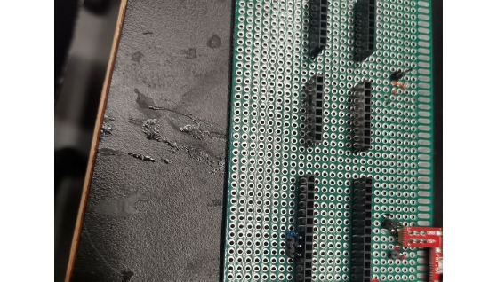
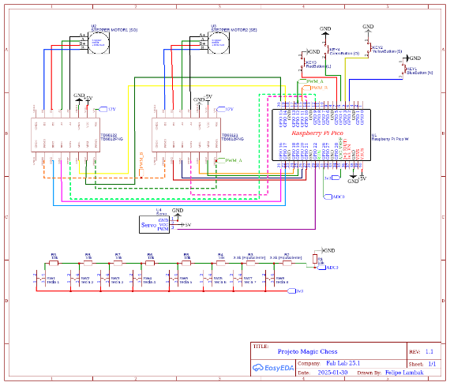
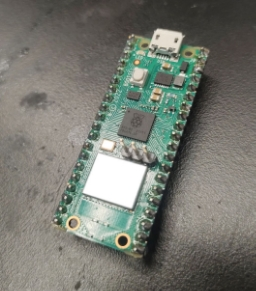
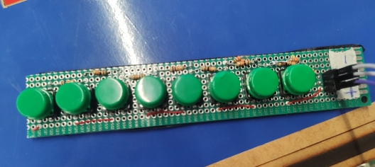

Projeto Magic Chess

INSPER - FAB LAB - L.A.C

[**Introdução	1**](#_takan11gr9mj)**

[**Justificativa	1**](#_f7vfbfxjqnx)

[**Objetivo	1**](#_izxdxd6ke40)

[**Materiais e Métodos	1**](#_1adbsuardtc5)

[**Desenvolvimento	4**](#_l4b8jt2kegds)

[Instalação dos Softwares	4](#_79zf8kv0vyhh)

[Programação da PICO	4](#_23e65vrvse3z)

[Recebendo informações da porta serial	4](#_l8ivxzgcg592)

[Controle do motor	4](#_qgr7zwve0dyx)

[Interrupção de fim de curso	5](#_y4ut5mzac8zj)

[Controle do servo motor	5](#_bnupxefxgixt)

[Calibração da movimentação	5](#_l6c5fa4m9zmt)

[GitHub do Projeto (Código comentado)	5](#_hctr18ahn1q6)

[Controle por teclado	5](#_ke2gmir3um2o)

[Calibração do teclado	5](#_wonl68ixdciz)

[Código de leitura	6](#_ebli1vih5fvh)

[**Resultados	6**](#_600ofuky0g7s)

[Calibração do movimento	6](#_q6ggximrl2tj)

[Limites de movimento	6](#_v40o9qvisune)

[Movimentação funcionando	6](#_mms68medsmg6)

[Movimentação por terminal	6](#_w0vrln22rawh)

[Função do jogo e regras provisórias	7](#_dmautibutsq)

[Movimentação das peças	7](#_f8eicu121afk)

[Vídeo do funcionamento	7](#_by1dn4193rdi)

[Interferência eletromagnética	7](#_cf7o4i63xzm7)

[**Conclusão	7**](#_bnsozly5gq8i)

[**Próximos passos	7**](#_o6ec59f1ztf)

[**Referências	9**](#_liacgrsjr2tw)
# 
# Introdução
Este projeto iniciou-se na segunda semana de janeiro, durante o estágio de férias de 25.1 no Fab Lab em parceria com o Laboratório de Arquitetura de Computadores  a fim de explorar o conteúdo da disciplina de sistemas embarcados, com uma estrutura do tabuleiro já antes construída teve-se como objetivo utilizá-la para movimentar peças de xadrez, baseando-se em um sistema com uma RaspBerry Pi Pico, a ideia deste dispositivo se inspira no “Xadrez de Bruxo” do universo fictício de Harry Potter, jogo cujas peças se movem apenas com os comandos do usuário.

# Justificativa 
Além de chamar a atenção para a área de microcontroladores com um dispositivo divertido e tecnológico para jogar xadrez, a implementação dessa ideia na prática, promove a busca por conhecimento acerca de programação em C, uso de servo motores, interrupções entre outras outras características de hardware e software. 

# Objetivo
O desenvolvimento deste protótipo tem como principal função estabelecer uma base para o aprimoramento do conceito de um xadrez “mágico”, permitindo que o dispositivo receba a informação da casa inicial e final e realize o movimento levando a peça com precisão e segurança.

# Materiais e Métodos

Para compor a parte eletrônica do projeto foram utilizados os seguintes materiais:

- 1 RaspBerry Pi PICO W RP2040
- 2 Motores de passo 12V DC
- 2 Motor Driver TB6612FNG
- 1 Servo motor SG90
- 2 Switch KW11 7 1 16A 250V AC 
- 2 Micro Switch KW10B 3T 1A 125V AC
- 1 Protoboard
- 1 Placa de Circuito Perfurada
- Jumpers
- 8 Botões
- 12 resistores de 10K Ohms

Durante os primeiros testes os componentes foram inseridos na protoboard e conectados utilizando jumpers, porém posteriormente as ligações foram transpostas para a placa de circuito perfurada(imagem 1) e as conexões foram soldadas com fios menores no verso da placa seguindo o esquema (imagem 2). 

Imagem 1 - Placa de circuito perfurada

Imagem 2 - Esquema elétrico

Como pode-se observar no esquema, o controle de PWM (Pulse Width Modulation) dos dois drivers foram unificados para facilitar o controle e as conexões

Além disso, os drivers (imagem 3) precisam ser alimentados com 12V para os motores e 5v para as operações lógicas assim como a RP 2040 (imagem 4), para isso utilizou-se uma fonte externa de 12V e a alimentação USB para 5v.

Imagem 3 - Motor Driver 

Imagem 4 - RP 2040

# Desenvolvimento
## Instalação dos Softwares
`	`Para poder iniciar o projeto fez-se necessária a instalação do sistema operacional Linux, assim como o VS Code e as extensões necessárias fornecidas no site da disciplina de Embarcados do insper [(Fonte 1)](https://insper-embarcados.github.io/site/infra-linux-docker/). 
## Programação da PICO 
### Recebendo informações da porta serial
`	`Através da biblioteca UART, realiza-se a leitura da porta serial para detectar os caracteres inseridos, após uma verificação no início do loop principal, a informação é processada e validada para gerar uma ação 
### Controle do motor
`	`Para controlar o motor, utilizou-se uma matriz 8x4 para representar o estado de cada entrada do motor, acionando os motores gradativamente para causar a rotação
### Interrupção de fim de curso
`	`Os 4 switches foram posicionados na estrutura para delimitar o final de curso do eixo, conectados com a RP 2040 utilizando o pull up interno e os padrões de IRQ (Interrupt Request) no código, conforme ensinado na disciplina de Embarcados [(Fonte 1)](#_liacgrsjr2tw).
### Controle do servo motor
`	`Para controlar os servos motores, utilizou-se uma biblioteca chamada pico servo, localizada também no github do projeto.

### Calibração da movimentação
`	`Medições foram realizadas para obter a relação mm por step(sequência completa do passo do motor) e mm por casa do tabuleiro. Obtiveram-se os dados apresentados nos resultados.

### GitHub do Projeto (Código comentado)
`	`Arquivo principal (main.c) localizado na pasta main do repositório: 

<https://github.com/felbk/infra-test.git> .
## Controle por teclado
A fim de controlar a movimentação para permitir uma versão jogador contra jogador, construiu-se um teclado utilizando botões com um divisor de tensão para identificá-los utilizando apenas uma porta analógica, conforme demonstrado na imagem 5 

imagem 5 - Teclado

### Calibração do teclado
`	`Para identificar os botões pela tensão de entrada, foi preciso realizar a leitura da entrada de 0 a 4096, observando a flutuação sem botão pressionado (nulo) e com os botões, observando os valores fornecidos na tabela 1 , para decidir qual botão foi selecionado, o sistema faz uma média de 10 valores, considerando apenas os não nulos.

|Botão|nulo|1|2|3|4|5|6|7|8|
| :- | :- | :- | :- | :- | :- | :- | :- | :- | :- |
|<=|500|680|780|980|1280|1680|2680|3580|4096|

### Código de leitura
`	`Aplicada na função Jogando( ), a leitura para movimentação segue a seguinte ordem: coluna inicial (A a H) ou X inicial , linha inicial (1 a 8) ou Y inicial , coluna final (A a H) ou X final , linha final (1 a 8) ou Y final.
#
# Resultados
## Calibração do movimento
`	`Após o processo de medição obtiveram-se as informações de que a máquina se move 0,8 mm para cada passo do motor (step completo) e que cada casa do tabuleiro possui largura e altura de 35mm.

## Limites de movimento
`	`Após a implementação dos switches de fim de curso em uma função de interrupção, sempre que o motor atinge algum dos limites o sistema para a movimentação e apenas a libera após mover a máquina para a direção oposta com a margem de distância definida no código.
## Movimentação funcionando
### Movimentação por terminal
`	`Após pouco mais de duas semanas do início do projeto, o protótipo podia se mover para norte, sul, leste, oeste e para as bissetrizes, a movimentação do eixo pode ser ativada digitando “X999/” no terminal, com 9 podendo ser qualquer algarismo e X podendo ser: N ,S , L ,O, Q (NO) , E (NE) , D (SE) , A  (SO), além do comando G999/ que posiciona isoladamente o servo motor no ponto desejado de 0 a 180 graus. Ao inserir qualquer comando citado acima com o valor 0 a frente, a máquina vai para sua origem (SO).

`	`Porém essa movimentação foi deixada apenas para debug, após a implementação da função jogando( ).
### Função do jogo e regras provisórias
`	`Para permitir uma versão competitiva local, além do controle por teclado, implementou-se uma matriz global para guardar a posição inicial das peças, que são alteradas antes de uma movimentação pela função análise() , a qual também verifica se haverá  captura de peça ou não.

`	`Até o momento as regras não restringem movimento, nem verificam jogadas irregulares.

### Movimentação das peças
`	`Com a função mover(Xi , Yi , Xf , Yf) é possível pegar uma peça de uma casa do tabuleiro e levar a outra, com as coordenadas iniciais e finais fornecidas. Nesta função, além de mover-se na horizontal vertical e diagonal, caso a movimentação seja diferente das anteriores ele irá se mover pelas linhas das casas do tabuleiro para evitar colidir em outras peças, visto que em uma partida essa movimentação só seria possível com o cavalo.

`	`Como nota-se no vídeo abaixo, a movimentação das peças foi pré definida na inicialização com uma sequência de funções mover() e funcionou algumas vezes durante os testes até chegar na sua melhor tentativa.

### [Vídeo do funcionamento](https://drive.google.com/file/d/1mCfQMoOVpqm8S3l5HQvBzTrIOA7VV4gu/view?usp=sharing)

## Interferência eletromagnética
`	`Algumas vezes o programa sofreu uma interrupção sem padrão de repetição e que não tinha relação com desvio na lógica de programação , principalmente quando os fios dos detectores de fim de curso ou do servomotor, estavam próximos ao motor, o que pode indicar que o motivo seja uma interferência do campo gerado ao movê-lo.
# Conclusão
`	`A movimentação dos motores e a alimentação 12V são os fatores que mais aparentam estar relacionados com os problemas apresentados. Dessa forma recomenda-se, como próximos passos, rever as conexões de alimentação, assim como pensar uma forma de otimizar a movimentação dos motores, como utilizar mais de um núcleo do microcontrolador para movimentar os dois motores de forma separada a fim de evitar problemas.

# Próximos passos 
`	`Após mitigar os problemas apresentados neste relatório, o projeto pode ser incrementado das seguintes maneiras:

- Revisão de captura e remoção das peças do tabuleiro
- Movimentação de roque na ala do rei e da rainha
- Desenvolvimento de um software para análise e validação das regras pré-movimento
- Movimentação por reconhecimento de voz do jogador
- Emissão de aviso sonoro de jogada 
- Desenvolvimento de um software de análise pós-movimento para verificar jogadas decisivas
- Reconhecimento de jogada por câmera
- Bot para jogar contra o usuário 
- Refatoração estética e estrutural

# 
# Referências
Acessos em jan de 2025 

Fonte 1 - <https://insper-embarcados.github.io/site/infra-linux-docker/>

Fonte 2 -<https://datasheets.raspberrypi.com/rp2040/rp2040-datasheet.pdf>

Fonte 3 -<https://learn.sparkfun.com/tutorials/tb6612fng-hookup-guide/all>

